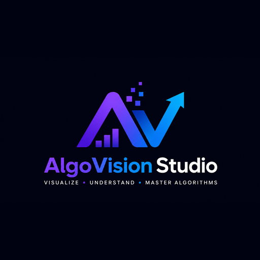
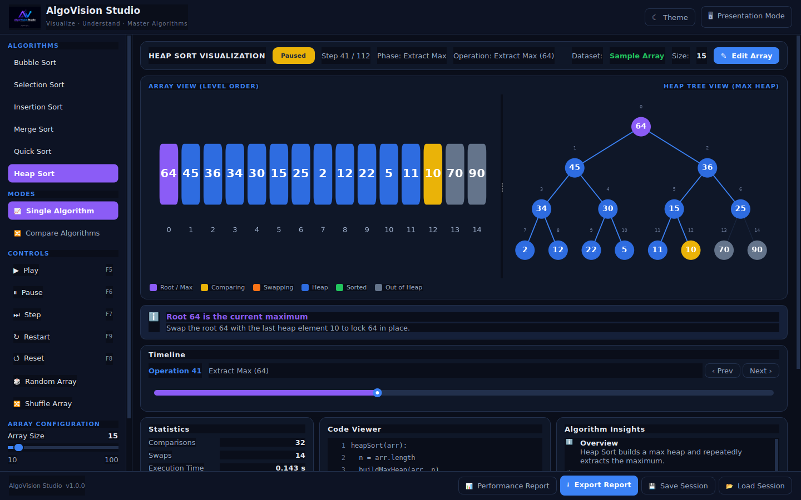
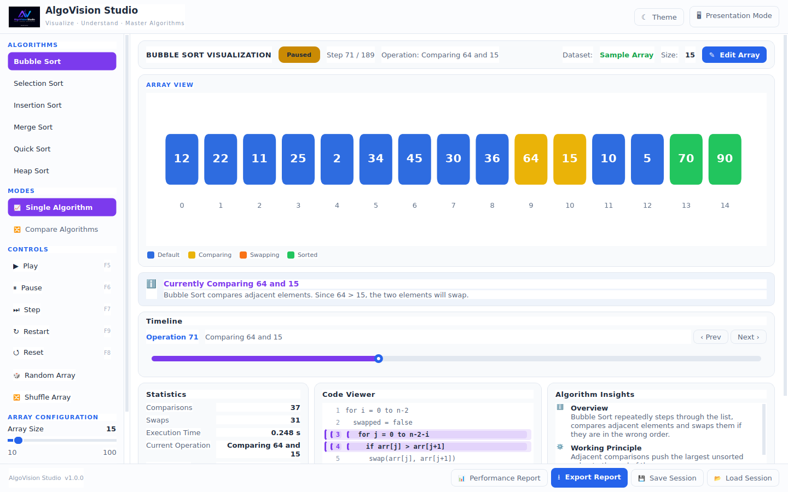
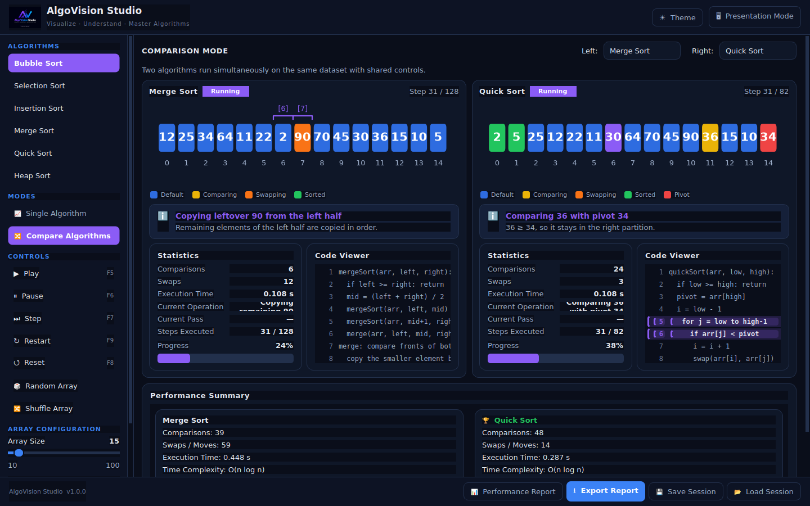
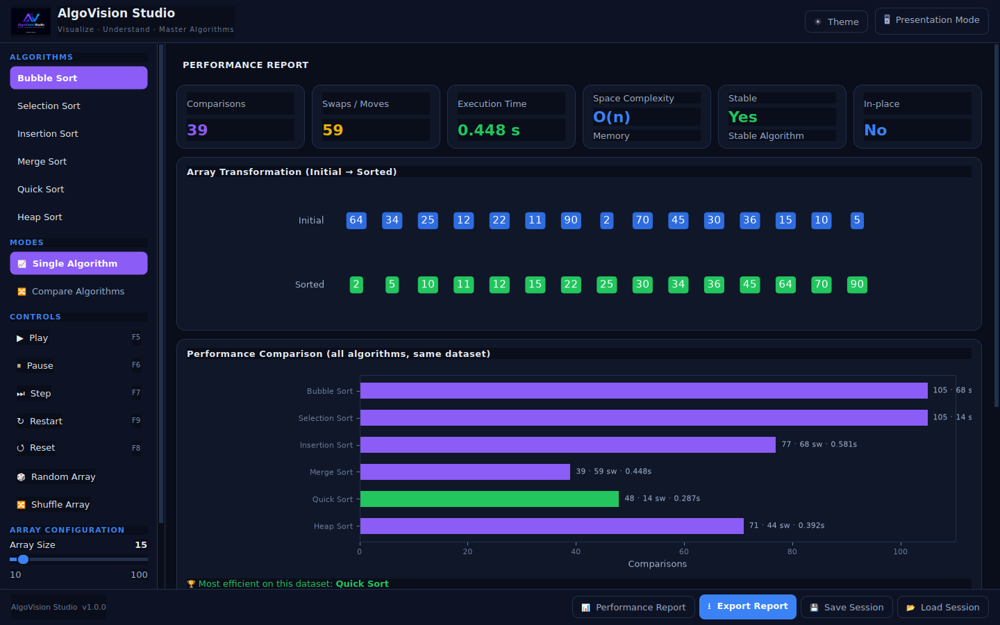
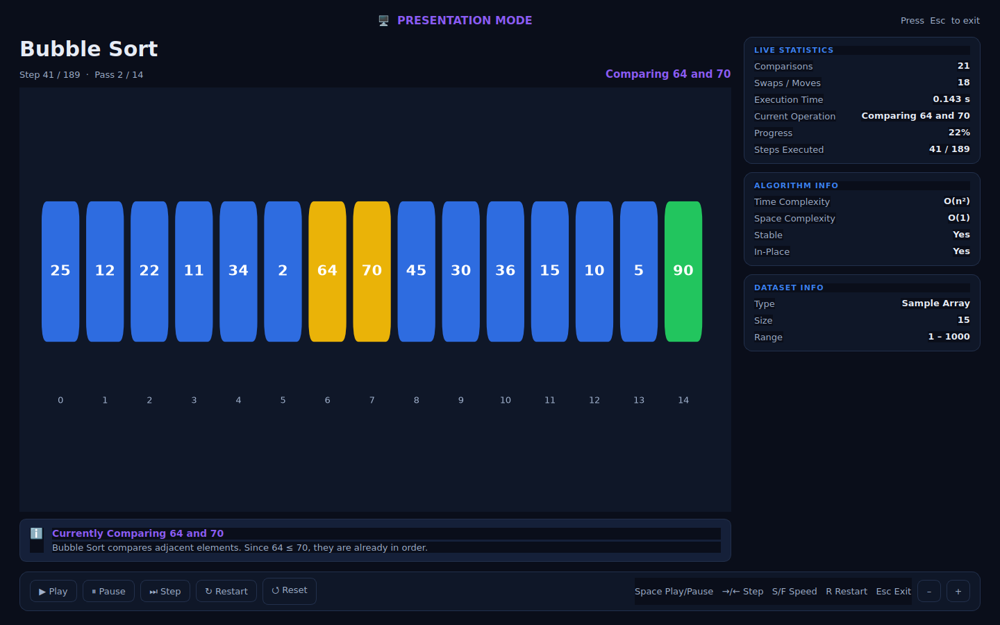

<p align="center">
  
</p>

<h1 align="center">AlgoVision Studio</h1>

<p align="center"><b>An offline desktop application for learning sorting algorithms.</b><br/>
Visualize · Understand · Master Algorithms</p>

<p align="center">
  
  
  
  
  
  
</p>

AlgoVision Studio is an interactive, fully offline educational tool that shows
*how* six classic sorting algorithms work through synchronized animations, live
statistics, highlighted pseudocode, plain-language explanations and side-by-side
comparison — built for classroom demonstrations, programming labs and
self-learning.

Built with **Python + PyQt6 + Matplotlib**. No internet, database, accounts or
external services required.

---

## 🖼️ Screenshots

| Heap Sort (Dark) — synchronized array + binary heap tree |
|:--:|
|  |

| Bubble Sort (Light) | Algorithm Comparison Mode |
|:--:|:--:|
|  |  |

| Performance Report | Presentation Mode |
|:--:|:--:|
|  |  |

---

## ✨ Features

| Area | What it does |
|------|--------------|
| **Six algorithms** | Bubble, Selection, Insertion, Merge, Quick and Heap Sort |
| **Numbered Block View** | Each element is a colour-coded block with its value and a fixed position index; auto-scales from 10 to 100 elements |
| **Synchronized panels** | Visualization, Statistics, Code Viewer, Explanation, Timeline and Performance tracking all update together on every operation |
| **Live Statistics** | Comparisons, swaps/moves, execution time, current operation, pass, progress and status |
| **Pseudocode highlighting** | The currently executing line(s) are highlighted and kept in view |
| **Algorithm Insights** | Overview, complexity (best/avg/worst), space, stability, in-place, advantages, limitations, applications |
| **Explanation Panel** | Plain-language, step-by-step description of each comparison / swap / insertion / merge / heapify |
| **Timeline Navigation** | Every operation is recorded; jump to, replay or continue from any operation |
| **Playback controls** | Play, Pause, Step, Restart, Reset + 0.25×–5× speed |
| **Heap Tree View** | Heap Sort shows a synchronized Numbered Block View **and** a Binary Heap Tree; clicking a node highlights the matching block and vice-versa |
| **Comparison Mode** | Run two algorithms simultaneously on the same dataset under one shared clock, with a winner summary |
| **Presentation Mode** | Distraction-free fullscreen view for projectors, with keyboard shortcuts, without interrupting the running algorithm |
| **Performance Report** | Post-run summary + all-algorithms comparison chart + execution overview |
| **CSV Export** | Export the execution summary (default `BubbleSort_ExecutionReport.csv`) |
| **Session Save/Load** | Save/restore algorithm, dataset, size, speed and theme locally (JSON) |
| **Light & Dark themes** | Switch instantly without interrupting execution |
| **Sample datasets** | Built-in presets in the Edit Array dialog |

---

## 🖥️ Requirements

- **Python 3.11 or later**
- **Windows** (the app is cross-platform Python/Qt and also runs on Linux/macOS)
- Dependencies in [`requirements.txt`](requirements.txt): PyQt6, Matplotlib

---

## 🚀 Installation & Running

```bash
# 1. (recommended) create a virtual environment
python -m venv .venv
# Windows:
.venv\Scripts\activate
# macOS / Linux:
source .venv/bin/activate

# 2. install dependencies
pip install -r requirements.txt

# 3. run the application
python main.py
```

On Windows you can also simply double-click `main.py` if `.py` files are
associated with Python, or create a shortcut to `pythonw main.py`.

---

## ⌨️ Keyboard Shortcuts

| Key | Action |
|-----|--------|
| `F5` | Play |
| `F6` | Pause |
| `F7` | Step (one operation) |
| `F8` | Reset |
| `F9` | Restart |

**Presentation Mode:** `Space` play/pause · `→` / `←` step · `S` / `F` slower/faster · `R` restart · `Esc` exit.

---

## 🎨 Visual Language

Element colours are consistent across every algorithm:

| State | Colour | Meaning |
|-------|--------|---------|
| Default | Blue | Not yet processed |
| Comparing | Yellow | Currently being compared |
| Swapping | Orange | Moving to a new position |
| Pivot | Red | Quick Sort pivot |
| Sorted | Green | In its final position |
| Selected / Root | Purple | Active minimum / key / heap root |
| Out of Heap | Gray | Outside the current heap (Heap Sort) |

---

## 📂 Project Structure

```
AlgoVisionStudio/
├── main.py                     # entry point
├── requirements.txt
├── README.md
├── assets/
│   ├── logo.png                # application logo
│   ├── icon.ico / icon.png     # window / taskbar icon
│   └── sample_datasets.json    # example datasets for every algorithm
├── algovision/
│   ├── app.py                  # QApplication + splash + bootstrap
│   ├── config.py               # value ranges, speeds, shortcuts (PRD §9)
│   ├── core/
│   │   ├── frames.py           # Frame snapshot model + Recorder
│   │   ├── player.py           # QTimer playback engine (Play/Pause/Step/seek)
│   │   ├── dataset.py          # random / shuffle / custom-input validation
│   │   ├── registry.py         # per-algorithm metadata, pseudocode, insights
│   │   └── algorithms/         # bubble, selection, insertion, merge, quick, heap
│   ├── theme/                  # palette + QSS stylesheet (light/dark)
│   ├── widgets/                # array view, heap tree, code viewer, stats,
│   │                           # insights, explanation, timeline, legend, sidebar
│   ├── views/                  # single, compare, report, presentation, main window
│   ├── models/session.py       # session save/load (JSON)
│   └── export/csv_export.py    # CSV report export
└── tests/test_core.py          # headless correctness tests for all algorithms
```

### How it works (architecture)

Each algorithm is **traced** into an immutable list of `Frame` snapshots — one
per operation — capturing the array, per-element state colours, running
statistics, the pseudocode line(s) to highlight and the explanation text. The
`Player` is simply an index into that list driven by a `QTimer`. Because every
frame fully describes the world, Play/Pause/Step/Restart and Timeline seeking
all stay perfectly synchronized and are completely reversible.

---

## 🧪 Testing

Headless correctness tests verify every algorithm sorts correctly (against
Python's `sorted()`), preserves the multiset on every frame, and ends fully
sorted — across reverse, already-sorted, duplicate, single-element and
100-element datasets:

```bash
python -m tests.test_core
```

---

## 📦 Build a standalone Windows .exe

A ready-made PyInstaller spec (`algovision.spec`) and a one-click build script
(`build_windows.bat`) are included. **On Windows**, just double-click
`build_windows.bat` (or run it from a terminal). It creates a virtual
environment, installs the dependencies + PyInstaller, and builds:

```
dist\AlgoVisionStudio.exe
```

A single windowed executable whose icon/thumbnail is the AlgoVision Studio logo
(`assets/icon.ico`). No console window; the whole `assets/` folder is bundled.

Manual equivalent:

```bat
pip install -r requirements.txt pyinstaller
pyinstaller --noconfirm algovision.spec
```

> **Note on cross-building from Linux:** the `.exe` must be built on Windows (or
> a recent Wine). PyInstaller cannot cross-compile, and Wine 9.0 in particular
> lacks the `ucrtbase.crealf` function that NumPy requires, so the build fails
> there. The same spec builds a native Linux binary on Linux
> (`pyinstaller --noconfirm algovision.spec`).

---

## 📖 Usage Walkthrough

1. **Select an algorithm** from the sidebar.
2. **Configure the dataset** — adjust Array Size, generate a Random Array,
   Shuffle, or click **Edit Array** to enter custom comma-separated values or
   pick a sample dataset.
3. **Start** with Play (or Step through one operation at a time).
4. **Observe** the synchronized visualization, statistics, pseudocode and
   explanation update live.
5. **Navigate** the Timeline to review any earlier operation.
6. Switch to **Compare Algorithms** to race two algorithms on the same data.
7. Open the **Performance Report** for a full post-run summary, or **Export
   Report** to CSV.
8. Use **Presentation Mode** for classroom / projector display, and **Save
   Session** to reuse a demonstration later.

---

*AlgoVision Studio runs completely offline. The focus is on **how** each
algorithm works — not just the final sorted result.*
